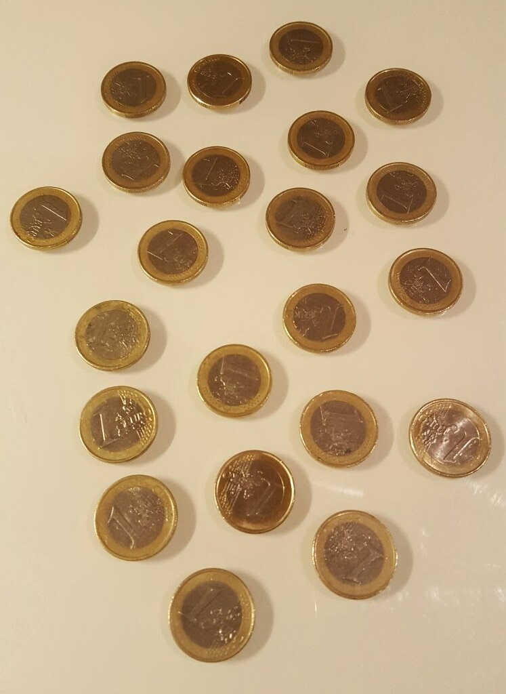

**Euro Coin Classifier**
========================
*This Euro Coin Classifier is part of the [Euro Coin Detector][4] project.*  
*The Main GitHub Repository: [Euro Coin Detector](https://github.com/chen-yumin/euro-coin-detector)*  

Introduction
------------------------
This **Euro Coin Classifier** is part of the [Euro Coin Detector][4] project that aims to locate and recognize euro coins from natural images and classify them according to their coin denomination and tell their values.

The training of this classifier uses statistics analytics to extract and process information from many images of the euro coin series of each denomination. The goal is to predict and generalize each euro coin type's attributes using *Machine Learning for Predictive Data Analytics* techniques.

The classifier is developed using *Artificial Intelligence* to describe the euro coins' shape, size, color, patterns, etc. so later the classifier can be used to determine whether an arbitrary object is a certain denomination of euro coin.  

Data Exploration and Analytics
------------------------
The reports are focused on *Descriptive Statistics* analytics. For each euro coin denomination, its HSI (Hue, Saturation, Intensity) and LUV (Luma, Blue Difference, Red Difference) color space values are the main area of interests.  

The reports can be found under the [reports](reports) folder.  

Data Preparation
------------------------
The [dataset_collector.py](dataset_collector.py) script is used to prepare dataset for the training of the classifier. It uses computer vision techniques to recognize and segment euro coins from natural images, and output the segmented coins into the *output* folder.  

The dataset collector takes natural images of euro coins as input, and process them into segmented image dataset that is ready for the classifier training process.  

Usage:

    python dataset_collector.py [image_files...]  

Multiple image files can be all passed at once to batch process them all.

Example:  

| Original | Processed |
| :---: | :---: |
|  |  |

Original: A natural image of 22 euro coins scattered on a surface.  
Processed: 22 separate images of euro coins cropped to just the coins themselves.  

Train Your Own Classifier
------------------------
After the dataset is ready and placed in the *data* folder, the training can start by running the [classifier_trainer.py](classifier_trainer.py) script. This script focuses on *Descriptive Statistics* analytics and process the data and output the reports under the *reports* folder in *.csv* format.  

Usage:

    python classifier_trainer.py  

Running the script will process all images in the *data* folder.  

 

Here's an example report from 1794 samples of 1-euro coins:

|                 | Count | Min | 1st Quart | Mean   | Median | 3rd Quart | Max | Std Dev |
|-----------------|-------|-----|-----------|--------|--------|-----------|-----|---------------|
| Hue             | 1794  | 3   | 10.0      | 23.17  | 13.0   | 15.0      | 156 | 30.28 |
| Saturation      | 1794  | 3   | 53.0      | 98.21  | 97.0   | 135.0     | 228 | 53.09 |
| Lightness       | 1794  | 52  | 94.0      | 118.85 | 115.0  | 141.0     | 218 | 31.94 |
| Luma            | 1794  | 48  | 78.0      | 102.55 | 98.0   | 123.0     | 209 | 31.75 |
| Blue Difference | 1794  | 93  | 112.0     | 117.80 | 118.0  | 124.0     | 151 | 7.54  |
| Red Difference  | 1794  | 77  | 134.0     | 141.26 | 142.0  | 149.0     | 164 | 9.28  |  

The histograms of the 1-euro coins:  
| Hue | Saturation | Intensity |
| :---: | :---: | :---: |
|  |  |  |

After the training, a classifier will be generated as a JSON file [euro_coin_detector_classifier.json](euro_coin_detector_classifier.json).  

Licensing
------------------------
Please see the file named [LICENSE.md](LICENSE.md).

Author
------------------------
* Chen Yumin  

Contact
------------------------
* Chen Yumin: [*http://chenyumin.com/*][1]
* CharmySoft: [*http://CharmySoft.com/*][2]  
* About: [*http://CharmySoft.com/about*][3]  
* Email: [*hello@chenyumin.com*](mailto:hello@chenyumin.com)  

[1]: http://chenyumin.com/ "Chen Yumin"
[2]: http://www.CharmySoft.com/ "CharmySoft"
[3]: http://www.CharmySoft.com/about "About CharmySoft"
[4]: http://www.CharmySoft.com/app/euro-coin-detector "Euro Coin Detector"
